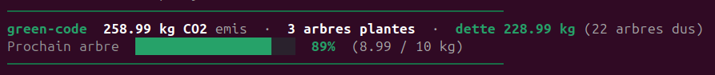

# green-code

Track your AI carbon footprint and plant trees to compensate.



## What it does

- Shows a carbon footprint summary at every Claude Code session start (CO2 emitted, trees planted, debt, progress bar towards next tree)
- Silently tracks your Claude Code token consumption at each session end
- Estimates energy use (kWh) and CO2 emissions based on published research
- Two modes: **auto** (plant trees automatically at threshold) or **manual** (track and plant on demand)
- Plants real trees via [Tree-Nation](https://tree-nation.com) API

## Install

```bash
/plugin marketplace add jsamson/green-code
/plugin install green-code@green-code-marketplace
```

On first launch, the plugin asks for your Tree-Nation API token and preferences.

## Commands

| Command | Description |
|---------|-------------|
| `/green:status` | View your carbon footprint and tree balance |
| `/green:plant` | Plant trees to offset accumulated CO2 |
| `/green:plant 3` | Plant a specific number of trees |
| `/green:config` | View current configuration |
| `/green:config mode auto` | Switch to auto-plant mode |

## How it works

### Token tracking

At each session end, the plugin reads `~/.claude/stats-cache.json` and computes the delta since the last check.

### Energy estimation

Per-model base cost in Wh per **output** token. Other token types are derived as ratios that match Anthropic's API pricing tiers (which track underlying compute cost):

| Model family | Wh / output token | Rationale |
|---|---|---|
| Opus | 0.002 | Dense ~400B-class, TokenPowerBench Llama-405B reference |
| Sonnet | 0.0008 | Mid-size MoE / dense |
| Haiku | 0.0003 | Small fast model |
| (unknown) | 0.001 | Conservative default |

| Token type | Ratio vs output | Effective Wh (Opus) |
|---|---|---|
| Output | 1.00 | 0.002 |
| Input (fresh) | 0.20 | 0.0004 |
| Cache creation | 0.25 | 0.0005 |
| Cache read | 0.02 | 0.00004 |

### CO2 conversion

- Default: 320 gCO2/kWh (cloud-provider weighted US mix with renewable PPAs; AWS sustainability report 2024)
- PUE 1.15 for datacenter overhead, aligned with AWS 2024 global average
- 1 tree = 10 kg CO2 (configurable)

### Tree-Nation

Trees are planted via the [Tree-Nation REST API](https://kb.tree-nation.com/knowledge/api-availability). You need a Tree-Nation account and API token.

## Sources

- TokenPowerBench, AAAI 2026 -- arxiv.org/abs/2512.03024 (per-model output-token energy at frontier scale)
- "Energy Considerations of LLM Inference", arXiv 2504.17674 (prefill vs decode energy)
- Luccioni et al., "Power Hungry Processing", ACM FAccT 2024
- AWS Sustainability Report 2024 -- aws.amazon.com/sustainability/data-centers/ (PUE 1.15)
- Anthropic Prompt Caching docs (cache read ~90% reduction vs fresh input)
- IEA, "Electricity 2024" -- iea.org/reports/electricity-2024

## Localization

Shell script output (session start, setup wizard, planting feedback) is auto-translated based on `$LANG`. Supported locales: `fr` and `en` (default). Skills (`/green:status`, `/green:plant`, `/green:config`) remain in English -- they are Markdown prompts loaded by Claude, who will naturally respond in the user's language anyway.

## Limitations

- Energy estimates have ~x2 uncertainty -- no AI provider publishes per-token energy data
- Claude's exact architecture (dense vs MoE) is not public
- CO2 depends on datacenter location; US mix is the default assumption
- `stats-cache.json` may not update in real-time in all Claude Code versions

## Prerequisites

- `jq` (JSON processor) -- install: `sudo apt install jq` / `brew install jq`
- `bc` (calculator) -- usually pre-installed on Linux/macOS
- `curl` -- usually pre-installed
- Tree-Nation account + API token

## License

MIT
